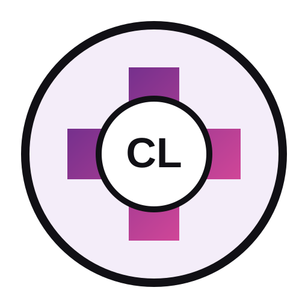

<p align="center">
  
</p>

# Comeaux Lady's Medical Supply Co.

**A Family Company — Built for Nurses, Trusted by Clinics.**

Enterprise medical-supply commerce + healthcare education monorepo for **Comeaux Lady's Medical Supply Co. / Comeaux Clinical Supply & Print Co.**

**Staging:** https://comeaux-ladys-medical-supply-staging.onrender.com

## Platform scope

- Medical-supply and nursing-equipment storefront
- Scrubs, support wear, badges, print/customization and clinic onboarding kits
- Texas nurse/CNA/Medication Aide verified savings
- Distance-learning LMS with human-authored curriculum and AI-assisted simulations
- CNA and Medication Aide program administration, attendance, grading and skills tracking
- TULIP/HHSC assisted transmittal workflows and audit evidence; no claim of direct state API submission unless officially authorized
- Stripe-ready commerce, invoices, receipts and payment-plan adapters
- Native iOS workspace
- OpenAPI contracts, Apigee API Hub registration artifacts and Google Artifact Registry publication scripts
- Render deployment configuration and GitHub CI/CD

## Monorepo

```text
apps/platform                  Next.js storefront + LMS + APIs
packages/brand                 brand identity and design tokens
packages/catalog               product/category/bundle taxonomy
packages/training              regulated-program metadata and curriculum map
packages/ai-core               scripted + provider-adapter simulation engine
packages/payments              checkout, invoice and installment contracts
packages/integrations          TULIP/external lifecycle gateway contracts
packages/publishing            PDF/print artifact registry types
packages/observability         audit-event contracts
contracts                      OpenAPI and integration contracts
db                             PostgreSQL schemas and seed contracts
mobile/ios                     SwiftUI/XcodeGen application scaffold
infra/gcp                      API Hub + Artifact Registry tooling
docs                           architecture, governance and operating manuals
```

## Rendering engines

- Static rendering for public brand/academy surfaces
- ISR for product catalog surfaces
- Dynamic SSR for operational dashboards
- Next.js route handlers for APIs and integration gateways
- SwiftUI native rendering for iOS
- Versioned publication/PDF artifact pipeline contracts
- Scripted simulation engine with optional external AI provider adapter

## Branch model

`main` → production; `release` → release candidate; `staging` → integrated staging; `qa` → validation; `develop` → integration; feature/chore/docs branches → isolated work.

Promotion sequence: **feature → develop → qa → staging → release → main**.

## Local development

```bash
npm install
npm run dev
```

## Verification

```bash
npm run typecheck
npm run build
npm run verify
```

The platform has been validated on Render with Node 24 / Next.js 16.3.3: production compilation, TypeScript validation and route generation passed with zero npm audit vulnerabilities at the foundation release.

## Regulatory boundary

The codebase can manage enrollment, curriculum delivery, assessments, attendance, instructor sign-off, payment, records and TULIP-ready packets. It must **not** represent a school, program, certificate, permit, state exam, TULIP submission, or regulatory approval as completed unless the applicable Texas authority has actually approved or accepted it.

Medication-administration performance remains instructor/school supervised. Public online content emphasizes law, resident rights, safety, observation, documentation, error prevention, reporting and scope rather than unsupervised procedural medication administration.

## Status

Foundation monorepo: **implemented and staging-validated; active development**.
